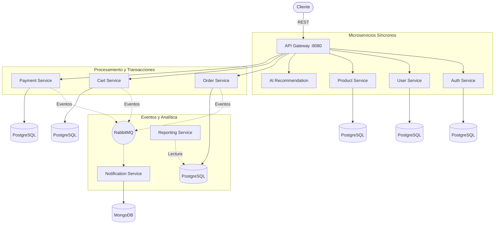

<div align="center">
  <h1>E-Commerce Platform</h1>
  
  <p>
    Plataforma de comercio electrónico basada en una arquitectura de microservicios moderna y políglota para demostrar un sistema escalable y distribuido.
  </p>

  <p>
    
    
    
    
    
    
    
    
  </p>
</div>

## Características

* **Arquitectura distribuida:** 10 microservicios completamente independientes y desacoplados.
* **API Gateway:** Enrutamiento centralizado y balanceo de carga básico.
* **Persistencia Aislada:** Bases de datos independientes por servicio (PostgreSQL y MongoDB).
* **IA Integration:** Sistema de recomendación de productos utilizando modelos fundacionales (Google GenAI).
* **Procesamiento Asíncrono:** Comunicación guiada por eventos a través de RabbitMQ.
* **Analítica Serverless:** Generación de reportes escalables usando AWS SAM.
* **Interfaz de Usuario:** Frontend interactivo construido con Next.js y Tailwind CSS.

## Capturas de pantalla

> **Nota:** Aquí irán las capturas de pantalla de la interfaz de usuario.
<!-- 
  <p align="center">
    
    
  </p>
-->

## Quick Start

Ejecuta el entorno completo (backend + bases de datos + frontend) en menos de 2 minutos:

```bash
# 1. Configurar entorno
cp .env.example .env

# 2. Levantar la infraestructura completa (Docker requerido)
docker-compose up --build -d

# 3. Arrancar el frontend
cd frontend
npm install && npm run dev
```

> **Servicios activos:** Frontend (`localhost:3000`) • API Gateway (`localhost:8080`)

## Arquitectura

El proyecto emplea una arquitectura orientada a servicios (SOA). A continuación se muestra la interacción de los componentes principales:



**Flujo de la arquitectura:**  
Todas las peticiones del cliente ingresan a través del **API Gateway**, el cual funciona como fachada y redirige de forma síncrona hacia el dominio correspondiente. Para operaciones que requieren consistencia eventual o tareas pesadas (como confirmar un pago y notificar al usuario), los servicios emiten eventos a **RabbitMQ**, los cuales son procesados asincrónicamente por el **Notification Service**.

## Tecnologías

| Dominio | Tecnologías | Componentes Involucrados |
| :--- | :--- | :--- |
| **Frontend** | Next.js, React, Tailwind CSS | `frontend` |
| **Enrutamiento** | Node.js, Express | `api-gateway` |
| **Backend (Java)** | Spring Boot 3 | `auth-service`, `user-service`, `product-service` |
| **Backend (Rust)** | Actix-web, Axum | `order-service`, `cart-service` |
| **Backend (Python)** | FastAPI, Flask | `payment-service`, `notification-service` |
| **Inteligencia Artificial** | FastAPI, Google GenAI | `ai-recommendation-service` |
| **Serverless** | AWS SAM, AWS Lambda | `serverless-reporting-service` |
| **Almacenamiento** | PostgreSQL, MongoDB | Todas las bases de datos aisladas |
| **Mensajería** | RabbitMQ | Comunicación asíncrona de eventos |

## Estructura del proyecto

```text
E-COMERCE/
├── ai-recommendation-service/   # Motor de recomendaciones
├── api-gateway/                 # Enrutamiento central
├── auth-service/                # Autenticación y JWT
├── cart-service/                # Carrito de compras
├── frontend/                    # Aplicación cliente web
├── notification-service/        # Gestión de notificaciones
├── order-service/               # Lógica de órdenes
├── payment-service/             # Procesamiento de pagos
├── product-service/             # Catálogo de productos
├── serverless-reporting-service/# Reportes analíticos
└── user-service/                # Gestión de usuarios
```

## Roadmap

- [x] Arquitectura base de microservicios.
- [x] Configuración de API Gateway.
- [x] Separación de bases de datos por dominio.
- [x] Motor de IA para recomendaciones básicas.
- [ ] Implementación completa de CI/CD (GitHub Actions).
- [ ] Monitoreo y trazabilidad (Prometheus, Grafana, OpenTelemetry).
- [ ] Cobertura total de pruebas unitarias y de integración.
- [ ] Refinamiento de la UI/UX del cliente web.

## Documentación y Contribución

Para obtener detalles de las APIs y patrones utilizados, revisa el directorio `docs/` o los archivos `README.md` de cada servicio. 

Si deseas contribuir, realiza un *fork* del repositorio, crea una nueva rama descriptiva y envía tu *Pull Request*. Las incidencias o propuestas de mejora pueden registrarse en los *Issues*.

---
<div align="center">
  <sub>Este proyecto ha sido desarrollado con fines académicos y de demostración técnica para la Universidad E.A.M. (Armenia, Quindío).</sub>
</div>
